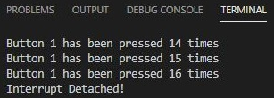

# Práctica 2A: Interrupción por GPIO

## CÓDIGO:

```
#include <Arduino.h>

struct Button {
  const uint8_t PIN;
  uint32_t numberKeyPresses;
  bool pressed;
};

Button button1 = {18, 0, false};

void IRAM_ATTR isr() {
  button1.numberKeyPresses += 1;
  button1.pressed = true;
}

void setup() 
{
  Serial.begin(115200);
  pinMode(button1.PIN, INPUT_PULLUP);
  attachInterrupt(button1.PIN, isr, FALLING);
}

void loop() 
{
  if (button1.pressed) {
    Serial.printf("Button 1 has been pressed %u times\n", button1.numberKeyPresses);
    button1.pressed = false;
  }

//Detach Interrupt after 1 Minute

static uint32_t lastMillis = 0;

  if (millis() - lastMillis > 60000) {
    lastMillis = millis();
    detachInterrupt(button1.PIN);
    Serial.println("Interrupt Detached!");
  }

}
```

## FUNCIONAMINETO:
En el código de la pràctica, primeramente hay que assignar un pin para la salida donde vamos a connectar el cable en que que vamos a connectar el pulsador en este caso sera en el pin 18 mediant la linea de código "Button button1 = {18, 0, false};".

Con este pulsador vamos a provocar interrupciones, las cuales van a ser efectuadas al pulsar el pulsador. Al hacerlo, y teniendo el programa monitoreado, se va a mostrar por pantalla el mensaje "Button 1 has been pressed %u times\n", donde %u es el numero de veces que se ha pulsado el pulsador, i cada vez que le demos va a sumar 1.

Cuando el pulsador no se use durante mas de un minuto, el programa va a mostrar por pantalla el mensaje "Interrupt Detached!", y para volver a poner en funcionameinto el programa hara falta hacer un RESET.


El muestreo por pantalla queda de la siguiente forma:



